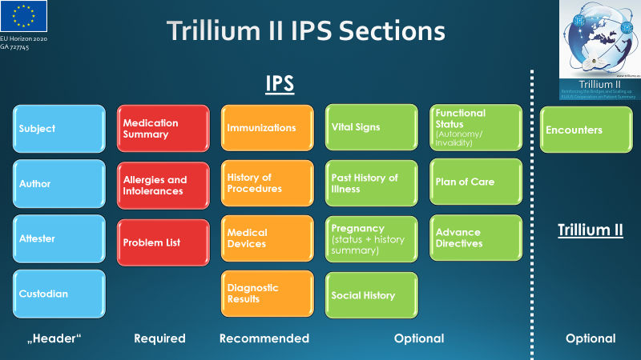

<!-- 
### Jekyll Site Variables

These are the site variables defined [here](http://wiki.hl7.org/index.php?title=IG_Publisher_Documentation#Jekyll):

- IG Business version specification (defined in ig.json)- {{site.data.fhir.ig.version}}  = {{site.data.fhir.ig.version}}

- IG status (defined in ig.xml)- {{site.data.fhir.ig.status}}  = {{site.data.fhir.ig.status}}

- Whether is experimental IG (defined in ig.xml) - {{site.data.fhir.ig.experimental}}  = {{site.data.fhir.ig.experimental}}

- IG Publisher name (defined in ig.xml) - {{site.data.fhir.ig.publisher}}  = {{site.data.fhir.ig.publisher}}

- dependency url - e.g. "uscore" : Base url of a dependency implementation Guide (defined in ig.json) -   {{site.data.fhir.uscore}} = {{site.data.fhir.uscore}}

- igName : Title of the implementation Guide (defined in ig.xml) -   {{site.data.fhir.igName}} = {{site.data.fhir.igName}}

- path : path to the main FHIR specification (defined in ig.json)-   {{site.data.fhir.path}} = {{site.data.fhir.path}}

- canonical : canonical path to this specification (defined in ig.json)-   {{site.data.fhir.canonical}}  = {{site.data.fhir.canonical}}

- errorCount : number of errors in the build file (not including HTML validation errors) -   {{site.data.fhir.errorCount}}  = {{site.data.fhir.errorCount}}

- version : version of FHIR -   {{site.data.fhir.version}}  = {{site.data.fhir.version}}

- revision : revision of FHIR -   {{site.data.fhir.revision}}  = {{site.data.fhir.revision}}

- versionFull : version-revision -   {{site.data.fhir.versionFull}}  = {{site.data.fhir.versionFull}}

- totalFiles : total number of files found by the build -   {{site.data.fhir.totalFiles}}  = {{site.data.fhir.totalFiles}}

- processedFiles : number of files genrated by the build -   {{site.data.fhir.processedFiles}}  = {{site.data.fhir.processedFiles}}

- genDate : date of generation (so date stamps in the pages can match those in the conformance resources) -   {{site.data.fhir.genDate}}  = {{site.data.fhir.genDate}}
-->
<blockquote class="stu-note">

This is the latest build <!-- Current officially released version --> of the {{site.data.fhir.igName}}, based on <a href="{{ site.data.fhir.path }}">FHIR Version {{ site.data.fhir.version }}</a>. See the <a href="history.html">Directory of published versions</a>.  This specification is the version currently used by the Trillium II community of practice. It is subject to change, which may be significant, as part of the Trillium II maintenance process. A stable version will b epublished at the end of the project.

Feedback is welcome and may be submitted through the <a href="https://github.com/gcangioli/trilliumII/issues">Trillium II GitHub issue tracker</a>.

</blockquote>

<!-- TOC  the css styling for this is \pages\assets\css\project.css under 'markdown-toc'-->

* Do not remove this line (it will not be displayed)
{:toc}

<!-- end TOC -->
# Scope
Formalize, through a FHIR Implementation Guide based on the HL7 FHIR IPS IG, the results of the Work Package 2 and 3 of the Trillium II project.

 
# Introduction
## The Trillium II project
<a href="https://trillium2.eu/">Trillium Bridge II - Reinforcing the Bridges and Scaling up EU/US Cooperation on Patient Summary</a> is a project funded from the European Union’s Horizon 2020 research and innovation programme under grant agreement No 727745, aiming to:
<ul>
<li>Improve international interoperability of Health systems in Europe, the United States, and globally</li>
<li>Accelerate adoption of interoperability standards in eHealth with validated open source interoperability assets and tools sharing experiences and lessons learned among standards organizations and patient initiatives</li>
<li>Identify key use cases for secure, seamless sharing of patient summaries at personal and population levels.</li>
</ul>

In this context Trillium II has investigated the adoption of the International Patient Summary (IPS) beyond the cross border unscheduled care scenario, extending its concept from a pure docuemntal approach to a reusable system of data blocks.

For more details about the project please refer to the <a href="https://trillium2.eu/">Trillium Bridge II project Web Site</a>

## The International Patient Summary
An International Patient Summary (IPS) document is an electronic health record extract containing essential healthcare information intended for use in the unscheduled, cross-border care scenario, comprising at least the required elements of the IPS dataset. The IPS dataset is **_a minimal and non-exhaustive patient summary dataset, specialty-agnostic, condition-independent, but readily usable by clinicians for the (cross-border) unscheduled care of a patient_**.

A formal definition of the International Patient Summary is provided by the CEN/TC 251 standard EN 17269.

## Trillium II Content overview

The IPS Composition

## Authors and Contributors

| Role  | Name | Organization | contact |
| --- | --- | --- | --- |
| **Primary Editor** | Giorgio Cangioli | WP3 Leader, HL7 Europe | giorgio.cangioli@gmail.com |
| **Primary Editor** | François Macary | Task 2.2 and 3.3 leader, Phast | francois.macary@phast.fr |
| **Contributor** | Catherine Chronaki | Scientific Coordinator, HL7 Europe | chronaki@gmail.com |
| **Contributor** | Alexander Berler | WP2 leader, GNOMON | a.berler@gnomon.com.gr |
| **Contributor** | Kai U. Heitmann | Task 2.1 leader, HL7 Europe | info@kheitmann.de |
| **Contributor** | Juha Mykkänen | Task 2.3 leader, THL | juha.mykkanen@thl.fi|
| **Contributor** | Anabela Santos | Task 2.4 leader, SPMS | Anabela.Santos.ext@spms.min-saude.pt |
| **Contributor** | Ariadna Rius | Task 2.5 leader, TicSalut | arsoler@ticsalut.cat |
| **Contributor** | Fotis Gonidis | Task 3.4 leader,GNOMON | f.gonidis@gnomon.com.gr |
| **Contributor** | Marco Eichelberg | Task 3.5 leader, OFFIS | eichelberg@offis.de |

For space reason the table has been limited to the task leaders, the list of contributors is however wider as documented by the Trillium II deliverables, see the <a href="https://trillium2.eu/">Trillium Bridge II project Web Site</a> for more details.

### HL7 FHIR IPS

| Role  | Name | Organization | contact |
| --- | --- | --- | --- |
| **Primary Editor** | Giorgio Cangioli, PhD | Consultant, HL7 Italy | giorgio.cangioli@gmail.com |
| **Primary Editor** | Rob Hausam | Hausam Consulting LLC | rob@hausamconsulting.com |
| **Primary Editor** | François Macary | Phast | francois.macary@phast.fr |
| **Primary Editor** |  Dr Kai U. Heitmann | Heitmann Consulting and Services, Gefyra GmbH, HL7 Germany | info@kheitmann.de  
| **Contributor** | Dr Christof Geßner | Gematik | christof.gessner@gematik.de |
| **Contributor** | Gary Dickinson | CentriHealth | gary.dickinson@ehr-standards.com |
| **Contributor** | Catherine Chronaki | HL7 International Foundation | chronaki@gmail.com |

